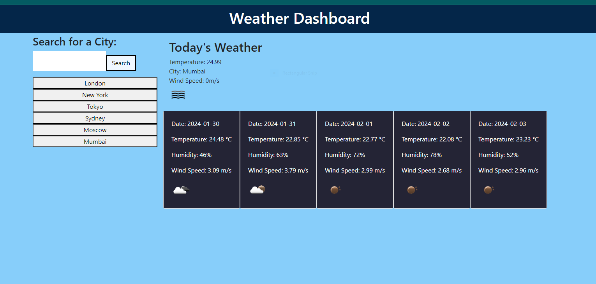

Module 9 Project 1: Interactive Front-End Application

The goal of this project was to create a front-end web application for displaying weather information. 
The application should allow users to search for a city, 
retrieve its current weather data, and display a 5-day weather forecast. 
Additionally, the project required the implementation of local storage
to store the user's search history and the ability to display buttons 
for the previously searched cities.

Achievements:
    Successfully implemented the basic structure of a weather dashboard.
    Developed a search functionality allowing users to input a city 
    and obtain real-time weather information.
    Implemented:  
    * The city name
    * The date
    * An icon representation of weather conditions
    * The temperature
    * The humidity
    * The wind speed 
    * 5-day forecast feature for each city
    Integrated local storage to store and retrieve the user's search history.
    Displayed buttons for the user's search history, allowing for quick access to past searches
    
Challenges Faced:
    Struggled with displaying data on the web page despite having the data in local storage.
    Sought assistance from the tutor, Katie Redford, 
    to identify and resolve a bug preventing the display of weather data.
    Received valuable advice from the tutor, including the suggestion to include 
    longitude and latitude in the code
    to enhance the accuracy of weather data retrieval
    
Key Learnings:
    Understanding and utilizing APIs for real-time data retrieval.
    Implementing dynamic elements in the user interface based on fetched data.
    Creating a responsive and interactive user experience with city buttons.

Next Steps:
    Explore alternative data formats for improved data representation.
    Enhance the application's design and user interface for a more polished look.
    Implement additional features or data points to enrich the user experience.
    Optimize code and explore performance improvements.

Conclusion:
   This project has been an interesting learning journey, 
   offering hands-on experience in front-end development, 
   API integration, and dynamic content creation. 
   
Links:
* Application GitHub URL:
* Scrinshot:
* Application deployed at live URL
